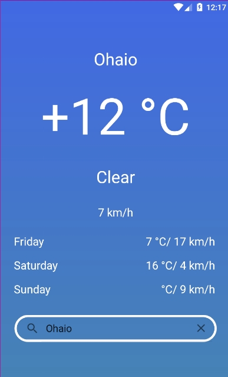

# Weather-App-Dagger-Hilt-Coroutines-MVVM-Retrofit2-LiveData
Retriving Weather Forecast with Retrofit2, MVVM, Dagger Hilt, Coroutines...

#### Api used https://goweather.herokuapp.com/weather/{city}  

Practing Clean code and Dependency Injection along some modern libraries 
in order to display the following screen: 

